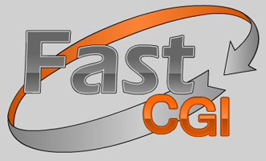

# Fast CGI Compatibility Layer
### For Go Programming Language


This repository stores documentation of CGI and FastCGI interfaces and 
programming tools which may be useful for building applications using the 
FastCGI interface in Go programming language, a.k.a. Golang.

These tools include a library written in Go language. This library provides 
objects, methods and functions to work with FastCGI interface in Go programming 
language.

The library implements methods for a FastCGI <b>client</b>, mostly.

Implementation of a FastCGI <b>server</b> can be found in a built-in standard library
of Go language – `net/http/fcgi` package, https://pkg.go.dev/net/http/fcgi.

## Structure

**N.B.** *Due to some bugs in Go language, the structure of this repository is 
heavily modified to meet the requirements of the Google's Golang proxy server 
which often throws funny messages. The most funny of them are messages stating 
that a package was downloaded but not found. If you are, like me, used to a 
strict repository layout which separates source code into an `src` folder and 
other stuff – into other folders, this structure is forbidden by Google's 
Golang.* 

So, knowing all the above, the structure of this repository is as 
follows:

* [DOC](doc) folder contains the documentation.
* Other folders contain various parts of the library for Go language.

## Usage

Usage examples can be found in the ['example'](example) folder.

A test application performing an execution of a simple PHP script is here:  
[cmd/RunSimplePhpScript](cmd/RunSimplePhpScript)

The most simple usage example requires only a few lines of code and is as
simple as the following code:
```go
package main

import (
  "fmt"
  "os"

  "github.com/vault-thirteen/Fast-CGI/example"
)

func main() {
  var err error
  err = runSimplePhpScript(`D:\Scripts\script.php`)
  if err != nil {
    panic(err)
  }
}

func runSimplePhpScript(scriptFilePath string) (err error) {
  var stdOut, stdErr []byte
  stdOut, stdErr, err = example.RunSimplePhpScript("tcp", "127.0.0.1:9000", scriptFilePath)
  if err != nil {
    return err
  }

  if len(stdErr) > 0 {
    _, err = fmt.Fprintln(os.Stderr, string(stdErr))
    if err != nil {
      return err
    }
  }

  if len(stdOut) > 0 {
    _, err = fmt.Fprintln(os.Stdout, string(stdOut))
    if err != nil {
      return err
    }
  }

  return nil
}
```

For more complex tasks, the `Client` object and its methods can be used.

## Why ?

<b>Reason 1</b>

> <b>FastCGI</b> interface provides a cross-platform and
cross-language interface for communication between totally different programming
language. For example, with the help of <b>FastCGI</b> it is possible to call
a function of a PHP language from the code written in Go language, where Go is
a compiled language and PHP is an interpreted language with no runtime
"engine".

<b>Reason 2</b>

> <b>FastCGI</b> interface is still actual for simple tasks and
applications where client code is not a bottleneck, e.g. for applications using
a lot of complicated SQL queries, such as bulletin boards and online forums.

<b>Reason 3</b>

> There are a lot of programming languages which still support the
<b>FastCGI</b> interface. And many of these languages are mature and
are sufficient for their purposes.

<b>Reason 4</b>

> This library allows to bring a new life into old projects
written in other programming languages that support the <b>FastCGI</b>
interface. It is not necessary to re-write PHP projects in Go from scratch.
This is why it is said in this repository, that this project is a compatibility
layer.

## Feedback
If you have any feedback, you are free to direct it to this GitHub repository:
* Comments should be written to the `Discussions` section:
  [here](https://github.com/vault-thirteen/Fast-CGI/discussions)
* Bug reports should be directed to the `Issues` section:
  [here](https://github.com/vault-thirteen/Fast-CGI/issues)
